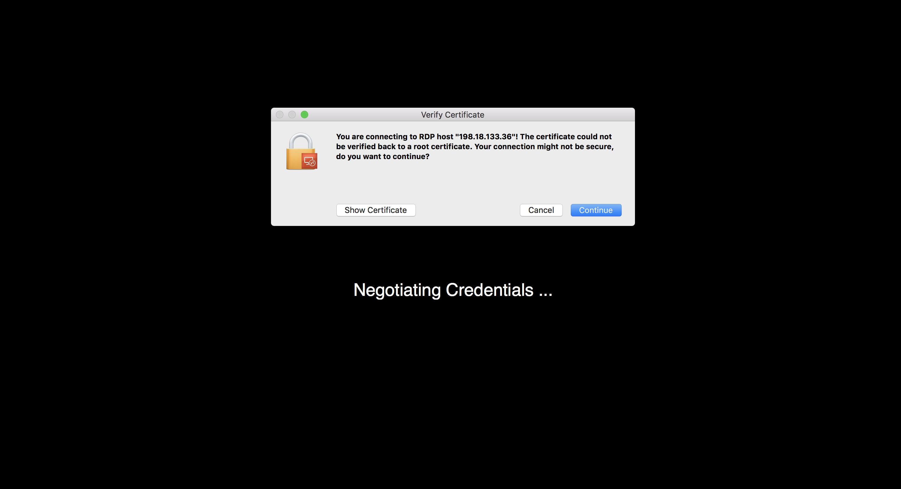
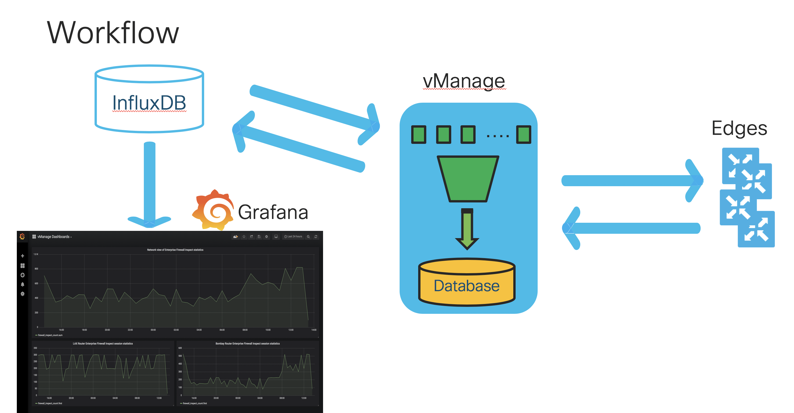
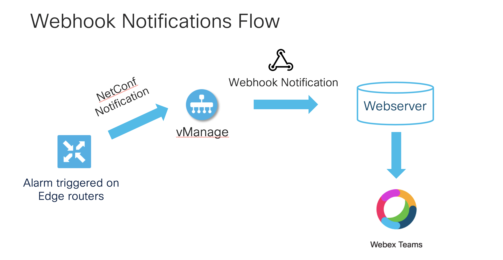

# DEVWKS-3484 (SD-WAN DevOps Step 4 - Monitoring and Analytics)

# Requirements

To use this code you will need

* Python 3.7+
* dCloud Pod : [Cisco 4D Secure SD-WAN (Viptela) Single DC](https://dcloud-cms.cisco.com/demo_news/cisco-4d-secure-sd-wan-viptela-single-dc-v3-3)

# Install and Setup

- Clone the code to local machine.

```
git clone https://github.com/suchandanreddy/sdwan-devops-devwks-3484.git
cd sdwan-devops-devwks-3484
```

- Create vpn_details file in below format

```
<POD Name> <Anyconnect Client> <VPN Username> <Password>
```

- Run Setup command to create docker container and initialise InfluxDB, Grafana as per requirements. 

```
./setup.sh
```

## RDP 

- **setup.sh** script prompts to login for Remote Desktop session to lab Jumphost. This VM has access to all network devices and we will run our python script for webhook use case on this VM.  

- Click **Continue** when prompted with an invalid certificate warning.



- Click on **administrator** and enter the password. 


| Parameter | Input |
| ------ | ------ |
| Username | **administrator**  |
| Password| **Instructor Provided** |


# Workshop Overview

## Platforms and Software used

| Component | Software Version |
| ------ | ------ |
| vManage  | 19.2.099 |
| XE-SDWAN (CSR1000v) | 16.12.1e |
| vEdge (vedge-cloud) | 19.2.099 |
| InfluxDB  | 1.7.4 |
| Grafana   | 6.0.2 |


## Use Case - 1

### Objective

- How to retrieve the Enterprise Firewall Inspect session counter values

- Store firewall inspect count values in a Time Series Database (TSDB) Influx DB

- Plot statistics on to Grafana Dashboard



## Use Case - 2

### Objective 

- Configure Webhook Notifications on vManage

- Spin up Webserver on Windows VM to process the webhook notifications data

- Trigger alert to WebEx Teams room based on the data recieved in Webhook Notification. 


